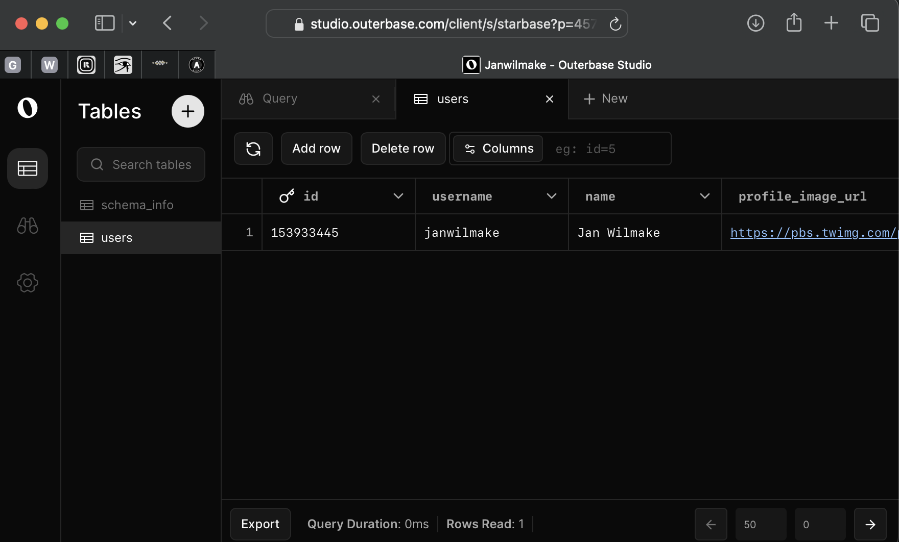

# 🛏️ DORM - Unlimited SQLite DBs Directly In Your Worker

[](https://uithub.com/janwilmake/dorm)

Dorm stands for Durable Object Relational Mapping. It effectively allows for a more DX friendly interface with [SQLite-DO's in Cloudflare](https://blog.cloudflare.com/sqlite-in-durable-objects/). Here's how it compares with vanilla SQLite DO's.

| Feature                         | Vanilla DOs | DORM |
| ------------------------------- | ----------- | ---- |
| Up to 10GB storage per DB       | ✅          | ✅   |
| Create unlimited DBs on the fly | ✅          | ✅   |
| Direct SQL queries              | ❌          | ✅   |
| Low code verbosity              | ❌          | ✅   |
| Built-in data exploration tools | ❌          | ✅   |
| JSON response format            | ❌          | ✅   |
| JSON schema support             | ❌          | ✅   |
| Data mirroring capability       | ❌          | ✅   |
| Simple ORM functionality        | ❌          | ✅   |
| Easy database sharding          | ❌          | ✅   |
| Simple worker integration       | ❌          | ✅   |

The hottest features, explained:

- 🔥 Abstracts away from the DO so you can just perform SQL queries to state from unlimited SQLite DBs, directly from your workers.
- 🔥 The query promises json directly from the worker. This makes working with it a lot simpler.
- 🔥 Compatible and linked with [@outerbase](https://outerbase.com) to easily explore the state of the DO or DOs
- 🔥 Allow creating tables from JSON-Schemas
- 🔥 Allows mirroring your queries/data in other database
- 🔥 Supports simple ORM functionality: create, update, remove, select

# 🚀 Top Use Cases

I've been playing with this for a while and wanted to share the most powerful use cases I've found for DORM:

## 🏢 Multi-tenant SaaS applications

One of the sickest use cases is for multi-tenant apps. Instead of dealing with complex data partitioning in a single database, you can just create a DB per customer/organization on the fly:

```ts
// Create a client for a specific tenant
const client = createClient(env.MY_DO_NAMESPACE, {
  version: "v1",
  name: `tenant:${tenantId}`, // Shards by tenant
  statements: [
    // Your schema here
  ],
});
```

This gives you natural data isolation without the complexity. Each tenant's data stays close to them, making everything VERY FAST. I've been using this approach for [Sponsorflare](https://sponsorflare.com) and it's been a game-changer.

## 🌎 Global user profiles with edge latency

If you're building something where users need fast access to their profile data anywhere in the world, this is perfect:

```ts
// Create a client for a specific user
const client = createClient(env.MY_DO_NAMESPACE, {
  version: "v1",
  name: `user:${userId}`, // Shards by user
  statements: [
    `CREATE TABLE IF NOT EXISTS preferences (
      key TEXT PRIMARY KEY,
      value TEXT NOT NULL
    )`,
  ],
});
```

The DO spawns as close as possible to where the user is accessing from, so their profile data, settings, preferences, etc., are all lightning fast. No more global latency issues!

## ⚡ Rate limiting and abuse prevention

This one's been super useful for me. Instead of complex distributed rate limiters, you can create databases keyed by IP or username to track usage:

```ts
// Create a rate limit tracker for an IP
const client = createClient(env.MY_DO_NAMESPACE, {
  version: "v1",
  name: `ratelimit:${ipAddress}`, // Shards by IP
  statements: [
    `CREATE TABLE IF NOT EXISTS requests (
      timestamp INTEGER,
      endpoint TEXT
    )`,
  ],
});

// Then you can insert new requests and check counts
await client.query(
  "INSERT INTO requests (timestamp, endpoint) VALUES (?, ?)",
  undefined,
  Date.now(),
  "/api/something",
);

const result = await client.query(
  "SELECT COUNT(*) as count FROM requests WHERE timestamp > ? AND endpoint = ?",
  undefined,
  Date.now() - 60000, // Last minute
  "/api/something",
);

if (result.json[0].count > 100) {
  // Too many requests!
}
```

The rate limiting happens at the edge, closest to the user, which means it's both fast and accurate. I've found this to be way simpler than using Redis or other distributed systems for this.

Hit me up if you've got other ideas or questions on these use cases!

# Usage & Demo

Installation is a snooze:

```
npm i dormroom
```

See [example.ts](example.ts) and [wrangler.jsonc](wrangler.jsonc) how to use!

See https://dorm.wilmake.com to see that live. This demonstrates it works using a users management API and HTML for that. X Post: https://x.com/janwilmake/status/1912146275597721959

The entire library is under 1000 lines of code with a minimalist API. Check out the source files directly to see the complete implementation - the code is the documentation

[](https://deploy.workers.cloudflare.com/?url=https://github.com/janwilmake/dorm)

# Why?

I'm looking for a simpler way to create stateful workers with multiple DBs. One of the issues I have with DOs is that they're hard to work with and your code becomes verbose quite easily. Also it's not yet easy to explore multiple databases. This is an abstraction that ensures you can perform state queries directly from your worker, queue, schedule, etc, more easily.

My ultimate goal would be to be able to hook it up to github oauth and possibly [sponsorflare](https://sponsorflare.com) and have anyone explore their own data.

I'm still experimenting. [Hit me up](https://x.com/janwilmake) if you've got ideas! Feedback much appreciated.

# Code Comparison: See How DORM Reduces Verbosity vs Vanilla DOs

DORM: Performing a simple query in a Worker

```ts
export default {
  async fetch(request, env, ctx) {
    // Initialize the client once
    const client = createClient(env.MY_DO_NAMESPACE, {
      version: "v1",
      statements: [
        `CREATE TABLE IF NOT EXISTS users (
        id TEXT PRIMARY KEY,
        name TEXT NOT NULL,
        email TEXT UNIQUE,
        created_at TIMESTAMP DEFAULT CURRENT_TIMESTAMP
      )`,
      ],
    });

    // Perform a query directly, no need for additional abstraction layers
    const result = await client.query(
      "SELECT * FROM users WHERE email = ? LIMIT 1",
      undefined,
      "user@example.com",
    );

    if (result.ok) {
      return new Response(JSON.stringify(result.json));
    } else {
      return new Response(JSON.stringify({ error: "Query failed" }), {
        status: result.status,
      });
    }
  },
};
```

This is how it'd work using a vanilla DO: The realistic approach with multiple abstraction layers

```ts
export default {
  async fetch(request, env, ctx) {
    // Need to create a DO ID first
    const id = env.MY_DO_NAMESPACE.idFromName("my_database");

    // Get the DO instance
    const doInstance = env.MY_DO_NAMESPACE.get(id);

    // Need to make an internal fetch request to the DO
    // Usually this would be wrapped in a helper function
    const doResponse = await doInstance.fetch(
      "https://dummy-url/getUserByEmail",
      {
        method: "POST",
        headers: { "Content-Type": "application/json" },
        body: JSON.stringify({ email: "user@example.com" }),
      },
    );

    // Need to handle the response from the DO
    if (doResponse.ok) {
      const data = await doResponse.json();
      return new Response(JSON.stringify(data.user));
    } else {
      const error = await doResponse.json();
      return new Response(JSON.stringify({ error: error.message }), {
        status: doResponse.status,
      });
    }
  },
};

// And your DO class would need:
class MyDO {
  constructor(state) {
    this.state = state;
    this.storage = state.storage;
    this.sql = state.storage.sql;

    // Usually need to initialize the schema somewhere
    this.initializeSchema();
  }

  async initializeSchema() {
    // Create tables if they don't exist
    this.sql.exec(`
      CREATE TABLE IF NOT EXISTS users (
        id TEXT PRIMARY KEY,
        name TEXT NOT NULL,
        email TEXT UNIQUE,
        created_at TIMESTAMP DEFAULT CURRENT_TIMESTAMP
      )
    `);
  }

  async fetch(request) {
    const url = new URL(request.url);

    if (url.pathname === "/getUserByEmail" && request.method === "POST") {
      try {
        const { email } = await request.json();

        // Call the separate method for the query
        const user = await this.selectUserWithEmail(email);

        if (user) {
          return new Response(JSON.stringify({ user }), {
            headers: { "Content-Type": "application/json" },
          });
        } else {
          return new Response(JSON.stringify({ message: "User not found" }), {
            status: 404,
            headers: { "Content-Type": "application/json" },
          });
        }
      } catch (error) {
        return new Response(JSON.stringify({ message: error.message }), {
          status: 500,
          headers: { "Content-Type": "application/json" },
        });
      }
    }

    return new Response("Not found", { status: 404 });
  }

  // The separate query method you mentioned
  async selectUserWithEmail(email) {
    const cursor = this.sql.exec(
      "SELECT * FROM users WHERE email = ? LIMIT 1",
      email,
    );

    const users = cursor.toArray();
    return users.length > 0 ? users[0] : null;
  }
}
```

# How does it work?

DORM is an abstraction to [Durable Objects](https://developers.cloudflare.com/durable-objects/). I've [played with DOs a lot](https://github.com/stars/janwilmake/lists/durable-objects), but this is an abstraction I find actually **very useful** because it allows a much less bloaty experience with data in a DO. The advantage compared to a [regular D1 database](https://developers.cloudflare.com/d1/) is that you can make as many of them as you want, on the fly, with up to 10GB a piece.

On top of that, one of the major problems with Cloudflare DOs is the ability to easily view the data. DORM has a smooth integration with [Outerbase Studio](https://github.com/outerbase/studio) so you can view all your data as well as manipulate it.



# Docs

For a deeper understanding about how this works, please read the docs from [Cloudflare themselves](https://developers.cloudflare.com/durable-objects/) about Durable Objects.

## Database naming

The best USP of DORM is the ability to create as many databases as you want. When creating the client, you can specify a name, which translates into a unique database. Because of this you can choose to shard your database in many different ways. By IP, by country or region, by username, or by company, for example. My biggest usecase for DORM is to shard data by user (for [Sponsorflare](https://github.com/janwilmake/cloudflare-sponsorware)), which makes sure the DO is spawned as close to the user as possible, making it VERY FAST. For doing ratelimits, you could use the IP/username as name as well.

## Migrations

Migrations are a pain. If you don't mind removing away all your data when migrating, the easiest way to migrate is to simply change the version in the config, which will be prefixed to the DO name such that you have a fresh database created. However, if this isn't an option, the current best way is to write migrations yousrelf with SQLite queries, for example, https://www.techonthenet.com/sqlite/tables/alter_table.php. Cloudflare may be improvign this in the future, but these are the optioins right now.

## Mirroring

DORM has **experimental** support for creating a mirror for every query you execute in a database. This mirror is most useful to create an aggregate of your data. For example, you can use a `{mirrorName: "db:root"}` for every `{name: username}` in order to have an aggregate of all users into a single database. For example, https://github.com/janwilmake/x-oauth-template uses it like this.

When creating mirrors, be wary of naming collsions and database size!

- **Unique id collisions**: when you use auto-increment and unique IDs (or columns in general), you may run into the issue that the value is unique in the main DB, but not in the mirror. This is currenlty not handled and your mirror query will silently fail! To prevent this issue I recommend not using auto increment or random in the query, and generate unique IDs beforehand when doing a query, so the data remains the same.

- **Size**: You have max 10GB. When executing a query, you can choose to `skipMirror:true` to not perform the same query in the mirror db, to save on size for DBs with larger tables.

Based on the code you've shared, I can see that error handling is fairly straightforward, using a conventional pattern of returning status codes and error messages in JSON responses. However, it could be more explicitly documented. Here are sections you could add to your README regarding error handling, performance, security, and limitations:

## Error Handling

DORM uses a simple approach to error handling: query operations return a result object with `{ json, status, ok }` structure. When an error occurs, the `ok` flag is set to `false`, the `status` contains the HTTP status code, and the `json` is `null`. This allows you to handle errors in a predictable way:

```javascript
const result = await client.query(
  "SELECT * FROM users WHERE id = ?",
  undefined,
  userId,
);
if (!result.ok) {
  console.error(`Error fetching user: ${result.status}`);
  // Handle the error appropriately
} else {
  // Process successful result
  const user = result.json[0];
}
```

For queries through the HTTP API, errors are returned as JSON responses with an appropriate status code and an `error` field containing the error message.

## Performance

DORM is a thin abstraction over Cloudflare's Durable Objects with SQLite. The performance overhead compared to vanilla DOs is minimal, as it's primarily adding ergonomics rather than additional processing layers. Since each database operates in its own DO, you get the benefit of edge-localized data access.

The biggest performance win comes from database sharding capability - by creating databases per user, region, or other dimensions, you can ensure data is stored and processed as close as possible to where it's needed, reducing latency significantly.

Keep in mind that while SQLite in DOs is fast, complex queries or large datasets will still have performance implications. Use appropriate indexes and keep your schemas optimized.

## Security

DORM allows exposing the DB over a REST API with basic security through an optional secret-based authentication for API access:

```javascript
const middlewareResponse = await client.middleware(request, {
  prefix: "/api/db",
  // Authentication secret
  secret: "my-secret-key",
});
```

When using DORM, ensure to use good pratices as you would with any DB. However, you should implement additional security layers for production use:

1. Use authentication mechanisms like JWT or OAuth for user or multi-admin REST access
2. Sanitize all SQL inputs to prevent injection attacks (DORM uses parameterized queries, which helps)
3. Use environment variables rather than hardcoding them

## Limitations

I'm still experimenting with DORM, so there are some limitations to be aware of:

- Currently, no built-in schema migration system (beyond creating a new version)
- Mirror functionality is experimental and has potential issues with ID collisions
- No built-in pagination helpers for large result sets
- Limited ORM capabilities compared to full-featured ORMs
- This is primarily designed for Cloudflare Workers environment, not for other platforms

DORM is meant to be minimal so there won't be better support for ORM features over time. For more advanced usage, you can just use the raw `query` functionality to do anything.

# Other projects

- The first version, [ORM-DO](https://github.com/janwilmake/orm-do), is more raw and doesn't provide the opinionated choices I made for an even smoother DX. It can be used as a starting point when you have other opinions :)
